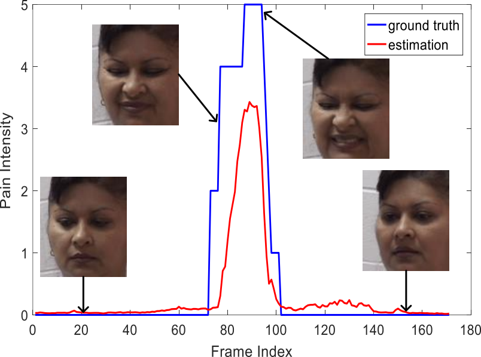

# PainRegression

Regularizing Face Verification Nets For Pain Intensity Regression

https://arxiv.org/abs/1702.06925



# Requirements

1. My Caffe (https://github.com/happynear/caffe-windows/tree/ms). If you don't want to train with class-balance sampling ([image_data_layer.cpp](https://github.com/happynear/caffe-windows/blob/ms/src/caffe/layers/image_data_layer.cpp)) and observing Pearson Correlation during training ([correlation_loss_layer.cpp](https://github.com/happynear/caffe-windows/blob/ms/src/caffe/layers/correlation_loss_layer.cpp)), you may use the official Caffe.
2. Matlab,
3. GPU with CUDA support,
4. MTCNN face and facial landmark detector(https://github.com/kpzhang93/MTCNN_face_detection_alignment).

# Regression Results and Evaluation

We uploaded some of the predicted values generated by our algorithm in `/results`. You may load them in Matlab and run [scripts/get_accuracy.m](https://github.com/happynear/PainRegression/blob/master/scripts/get_accuracy.m) to get the performance under various metrics.

# Training

1. Download the UNBC-McMaster Shoulder Pain Dataset(http://www.consortium.ri.cmu.edu/painagree/). Delete the black files in `095-tv095\tv095t1afaff`.

2. Download the pre-trained face verification model from [Google Drive](https://drive.google.com/file/d/0B0OhXbSTAU1HUTVhNE1sX1o2STQ/view?usp=sharing) or [Baidu Yun](http://pan.baidu.com/s/1pKOmZZt).

3. Detect and align the faces in the dataset by [./scripts/general_align.m](https://github.com/happynear/PainRegression/blob/master/scripts/general_align.m).

4. Create list for Caffe's ImageData layer by [./scripts/create_list.m](https://github.com/happynear/PainRegression/blob/master/scripts/create_list.m) and [./scripts/create_sublist.m](https://github.com/happynear/PainRegression/blob/master/scripts/create_sublist.m)(For cross-validation).

5. Copy all the folders created by [./scripts/create_sublist.m](https://github.com/happynear/PainRegression/blob/master/scripts/create_sublist.m) to `./prototxt/` and run [./prototxt/run_script.cmd](https://github.com/happynear/PainRegression/blob/master/prototxt/run_script.cmd).

It takes about 4-6 hours to train all 25-fold cross validation.

# Validation

1. Use [./scripts/extract_feature.m](https://github.com/happynear/PainRegression/blob/master/scripts/extract_feature.m) to extract results from the 25-fold cross-validation (because I didn't write the logic when detector cannot find face in the image).

2. Get the performance by [./scripts/get_accuracy.m](https://github.com/happynear/PainRegression/blob/master/scripts/get_accuracy.m).

We encourage future works to use the new proposed evaluation metrics, **wMAE** and **wMSE**. The evaluation codes are in [./scripts/get_accuracy.m](https://github.com/happynear/PainRegression/blob/master/scripts/get_accuracy.m).

# EmotionNet Challenge

The model definition files used in [EmotionNet Challenge](http://cbcsl.ece.ohio-state.edu/EmotionNetChallenge/index.html) are provided in [./prototxt/EmotionNet](https://github.com/happynear/PainRegression/tree/master/prototxt/EmotionNet). Besides the details described in our submitted paper, we further used a novel technique called `mirror face` to encode the features both from frontal face and mirror face, in an end-to-end fashion. The details and analysis will be described in a comming journal paper.

To try the `mirror face` technique, you need to compile my Caffe (https://github.com/happynear/caffe-windows/tree/ms), or transplant the `flip_layer` to your own Caffe.

# License

This code is distributed under MIT LICENSE

# Citation

If you find these codes useful in your research, please cite
```
@inproceedings{wang2017regularizing,
  title={Regularizing Face Verification Nets For Pain Intensity Regression},
  author={Wang, Feng and Xiang, Xiang and Liu, Chang and Tran, Trac D and Reiter, Austin and Hager, Gregory D and Quon, Harry and Cheng, Jian and Yuille, Alan L},
  booktitle={IEEE International Conference on Image Processing 2017},
  year={2017},
  organization={IEEE Xplore}
}
```

# Contact

Feng Wang [feng.wff(at)gmail.com] or Xiang Xiang [xxiang(at)cs.jhu.edu]

(please replace (at) with @.)
